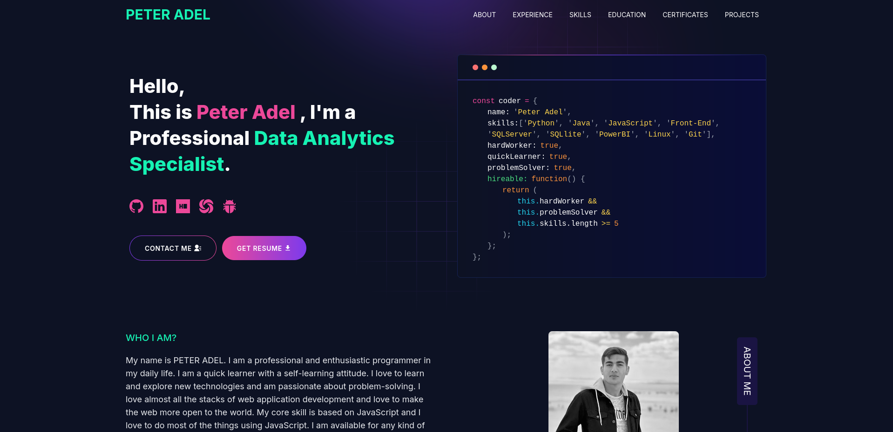

# Developer Portfolio

#### Looking to craft a stunning professional portfolio that truly represents your skills? Your search ends here! With the powerful Developer Portfolio template, you can effortlessly design a personalized portfolio that stands out. Whether you're a developer or a freelancer, this website is built for you—easy to navigate, fully customizable, and tailored to showcase your unique expertise. Start building your future today!
---

# Demo :movie_camera:



## View live preview [here](https://peteradel.netlify.app/).

---


<h2 align="center">Hi 👋! My name is Peter <br>and I'm Developer passionate about computer science, Data Analytics Specialist and Cyper security</h2>


###

<div align="center">
  
  
  
  
  
  
  
  
  
  
  
  
  
  
  
  
  
  
  
  
  
  
  
  
  
  
  
  
  
  
  
  
  
  
  
  
  
  
  
</div>

###


<div align="center">
  <a href="https://www.linkedin.com/in/1peteradel/" target="_blank">
    
  </a>
  <a href="mailto:0PeterAdel@proton.me" target="_blank">
    
  </a>
  <a href="https://discord.com/users/Peter_Adel" target="_blank">
    
  </a>
</div>

---

## Table of Contents :scroll:

- [Sections](#sections-bookmark)
- [Demo](#demo-movie_camera)
- [Installation](#installation-arrow_down)
- [Getting Started](#getting-started-dart)
- [Usage](#usage-joystick)
- [Deployment](#deployment-rocket)
- [Tutorials](#tutorials-wrench)
  - [Gmail App Password Setup](#gmail-app-password-setup)
  - [Create a Telegram Bot](#create-a-telegram-bot)
- [Packages Used](#packages-used-package)

---

# Sections :bookmark:

- HERO SECTION
- ABOUT ME
- EXPERIENCE
- SKILLS
- PROJECTS
- EDUCATION
- BLOG
- CONTACTS

---

# Installation :arrow_down:

### You will need to download Git and Node to run this project

- [Git](https://git-scm.com/downloads)
- [Node](https://nodejs.org/en/download/)

#### Make sure you have the latest version of both Git and Node on your computer.

```bash
node --version
git --version
```

## <br />

# Getting Started :dart:

### Fork and Clone the repo

To Fork the repo click on the fork button at the top right of the page. Once the repo is forked open your terminal and perform the following commands

```bash
git clone https://github.com/<YOUR GITHUB USERNAME>/developer-portfolio.git

cd developer-portfolio
```

### Install packages from the root directory

```bash
npm install
# or
yarn install
```

Then, run the development server:

```bash
npm run dev
# or
yarn dev
```

Open [http://localhost:3000](http://localhost:3000) with your browser to see the result.

---

# Usage :joystick:

Please create a new `.env` file from `.env.example` file.

Eg:

```env
NEXT_PUBLIC_GTM =
NEXT_PUBLIC_APP_URL =
TELEGRAM_BOT_TOKEN =
TELEGRAM_CHAT_ID =
GMAIL_PASSKEY =
EMAIL_ADDRESS =
```

### Then, Customize data in the `utils/data` [folder](https://github.com/said7388/developer-portfolio/tree/main/utils/data).

Eg:

```javascript
export const personalData = {
  name: "Peter Adel",
  profile: "/profile.png",
  designation: "Data Analytics Specialist",
  description: "My name is Peter Adel...",
  email: "0PeterAdel@proton.me",
  phone: "+1140906414",
  address: "Egypt",
  github: "https://github.com/0PeterAdel",
  linkedIn: "https://www.linkedin.com/in/1peteradel/",
  cybertalants: "https://cybertalents.com/members/H_0/profile",
  sololearn: "https://www.sololearn.com/en/profile/21778301",
  hackerRank: "https://www.hackerrank.com/profile/1peteradel",
  codeforce: "https://codeforces.com/profile/Peter_Adel",
  resume: "...",
};
```

---

# Deployment :rocket:

Deploying the app to platforms like Vercel or Netlify is quick and easy.

## Deploying to Vercel:

1. **Sign up or log in** to [Vercel](https://vercel.com/).
2. Once logged in, click on **"New Project"**.
3. Select your **GitHub repo** (the one that contains your forked project) and click **Import**.
4. Configure your environment variables in the Vercel dashboard by adding each key from your `.env` file.
   - E.g., `NEXT_PUBLIC_GTM`, `NEXT_PUBLIC_APP_URL`, `TELEGRAM_BOT_TOKEN`, etc.
5. Click on **Deploy**. Vercel will automatically detect your Next.js app and build it.
6. Once the deployment is complete, you can visit your live website!

### Updating After Deployment

Whenever you push changes to your GitHub repo, Vercel will automatically redeploy the app, keeping your portfolio up-to-date.

## Deploying to Netlify:

1. **Sign up or log in** to [Netlify](https://www.netlify.com/).
2. In the **Netlify Dashboard**, click **"New site from Git"**.
3. Connect your **GitHub** account and select your repo.
4. Configure your environment variables by going to **Site Settings > Build & Deploy > Environment** and adding keys from your `.env` file.
5. Click **Deploy Site**. Netlify will build and deploy your portfolio.

---

# Tutorials :wrench:

## Gmail App Password Setup

1. **Log in to your Google Account** at [https://myaccount.google.com/](https://myaccount.google.com/).
2. Navigate to **Security** from the left sidebar.
3. Scroll down to the **"Signing in to Google"** section and make sure **2-Step Verification** is turned ON.
4. Once 2-Step Verification is enabled, you'll see an option for **App Passwords**.
5. Click on **App Passwords**. You may need to enter your Google account password again.
6. In the **Select app** dropdown, choose "Mail", and for **Select device**, choose "Other (Custom name)" and name it appropriately (e.g., "Portfolio").
7. Click **Generate**. A 16-character app password will be displayed. Save this password for later use in your environment variables (e.g., `GMAIL_PASSKEY`).

## Create a Telegram Bot

1. **Open Telegram** and search for the user **@BotFather**.
2. Start a chat with BotFather and use the `/newbot` command to create a new bot.
3. Choose a name for your bot.
4. Set a unique username for your bot (must end with `bot`, e.g., `PortfolioAssistantBot`).
5. Once your bot is created, BotFather will send you a **Token**. Save this token, as you will need it for your environment variables (e.g., `TELEGRAM_BOT_TOKEN`).
6. To get your chat ID:
   - Open your bot in Telegram and send it a message.
   - Visit the following URL in your browser, replacing `BOT_TOKEN` with your actual bot token:  
     `https://api.telegram.org/bot<BOT_TOKEN>/getUpdates`
   - Look for the `chat` object in the response, which contains your **chat ID** (you can use this value for `TELEGRAM_CHAT_ID`).

---

# Packages Used :package:

|   Used Package List    |
| :--------------------: |
|    @emailjs/browser    |
|  @next/third-parties   |
|         axios          |
|      lottie-react      |
|          next          |
|       nodemailer       |
|         react          |
|       react-dom        |
|   react-fast-marquee   |
| react-google-recaptcha |
|      react-icons       |
|     react-toastify     |
|         sharp          |
|          sass          |
|      tailwindcss       |

---


<p align="center">
  
</p>

###
